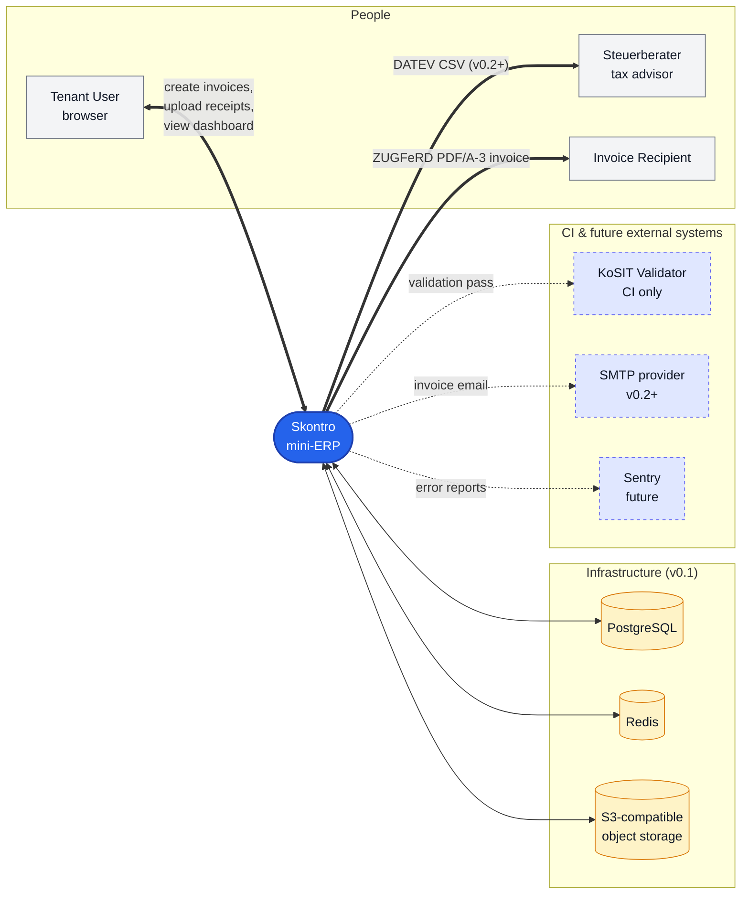

# 3. Context and Scope

This section delimits Skontro from its external collaborators. It documents two perspectives: the **business context** (who interacts and why, in domain terms) and the **technical context** (which protocols, formats, and infrastructure those interactions actually use).

## 3.1 Business Context

The diagram below shows Skontro and its external collaborators. Each connection is a domain-level interaction expressed in business terms (the technical protocol is in §3.2).

The diagram shows the system at architecture Level 1 (C4 notation): Skontro is the single box in the centre, surrounded by external actors, downstream consumers, and infrastructure dependencies. The interactions are described in §3.2.

### External entities

| Entity | Type | Direction | Purpose |
|---|---|---|---|
| Tenant User | Human actor | Bidirectional | Primary user. Owners, admins, accountants, viewers interact via the SPA. |
| Steuerberater | Human actor (indirect) | Outbound | Consumes DATEV CSV exports produced from v0.2 onward. Skontro does not connect directly to DATEV. |
| Invoice Recipient | Human actor (indirect) | Outbound | Receives ZUGFeRD-compliant hybrid PDF/A-3 + XML invoices via email or download link. |
| PostgreSQL | External system | Bidirectional | Primary relational store; tenant data isolated by `tenant_id` discriminator. |
| Redis | External system | Bidirectional | Cache, session, and queue backend. |
| S3-compatible object storage | External system | Bidirectional | Stores generated PDF invoices and uploaded receipts. Keyed by SHA-256 to enable deduplication. |
| KoSIT Validator | External system (CI only) | Outbound | Official German validator; verifies that generated invoices conform to EN 16931 / XRechnung schema. Runs in CI, not in production. |
| SMTP provider | External system (future) | Outbound | Email delivery of invoices and notifications. Introduced in v0.2. |
| Sentry | External system (future) | Outbound | Error tracking and performance monitoring. Introduced when production demo deploys. |
| ML Service | External system (future, internal) | Bidirectional | Private HTTP service for receipt OCR, categorization, forecasting. Introduced in v0.3. Same operational tenancy as the main system; not an external party. |

## 3.2 Technical Context

The table below documents the protocol, format, and direction of every interaction shown in the business context.

| Interaction | Protocol | Format | Direction | Notes |
|---|---|---|---|---|
| Tenant User ↔ Skontro | HTTPS | HTML + JS bundle (frontend); JSON (API) | Bidirectional | Production enforces HTTPS. Browser sends Sanctum bearer token in `Authorization` header. |
| Skontro ↔ PostgreSQL | PostgreSQL wire protocol over TCP | Binary | Bidirectional | TLS in production. Connection pool via PHP-FPM workers. |
| Skontro ↔ Redis | Redis protocol over TCP | Binary | Bidirectional | TLS optional; default in production. |
| Skontro ↔ S3 | HTTPS | S3 REST API | Bidirectional | Signed URLs with time-limited validity for client downloads. |
| Skontro → Invoice Recipient | (Email, v0.2+) SMTP TLS | MIME, ZUGFeRD PDF/A-3 attached | Outbound | v0.1 produces files for manual download; v0.2 adds direct email delivery. |
| Skontro → Steuerberater | Manual / SFTP / portal upload (out of band) | DATEV CSV (ASCII) | Outbound | Skontro produces the file; the user moves it to DATEV. v0.2+. |
| Skontro → KoSIT Validator | HTTPS (CI runner) | XML | Outbound | Validation runs on every CI build over a corpus of test invoices. |
| Skontro → Sentry | HTTPS | Sentry SDK protocol | Outbound | Future. |
| Skontro ↔ ML Service | Private HTTP over Docker network | JSON | Bidirectional | v0.3+. Backend acts as ML-service client; ML service never reachable from outside. |

### Format references

- **EN 16931** — European standard for electronic invoicing. Skontro generates the ZUGFeRD 2.1 EN16931 profile.
- **ZUGFeRD 2.1** — Hybrid PDF/A-3 with embedded `factur-x.xml`. The German implementation of EN 16931 in hybrid form.
- **XRechnung** — Pure-XML EN 16931 profile mandated for B2G invoicing in Germany. Skontro accepts XRechnung on input (v0.2+) and may emit it in a future release.
- **DATEV CSV** — De facto standard for handing books to German Steuerberater. ASCII, semicolon-delimited, character set Windows-1252 (CP1252) or UTF-8 depending on configuration. v0.2+ implementation.
- **SEPA `pain.001`** — ISO 20022 payment initiation message. v0.2+ implementation for batch payment file export.
