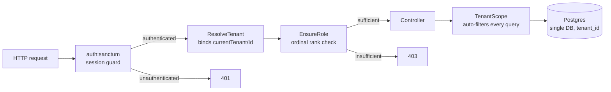
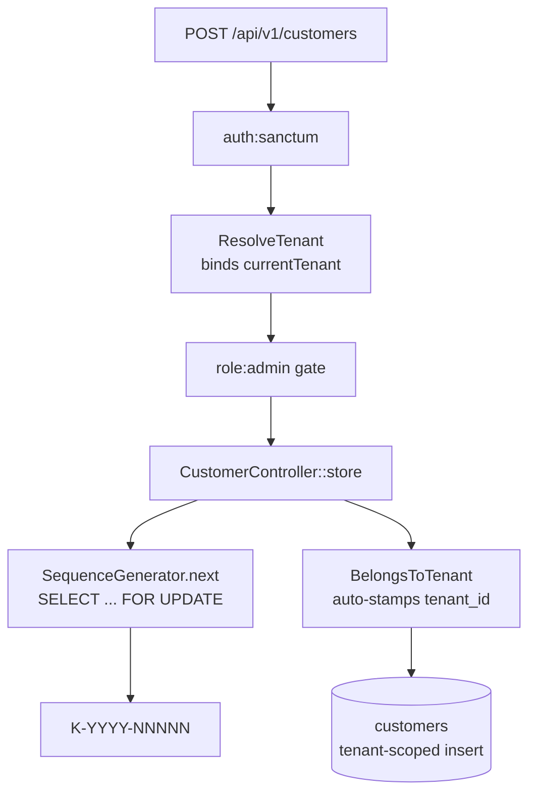
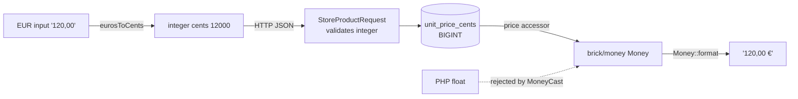
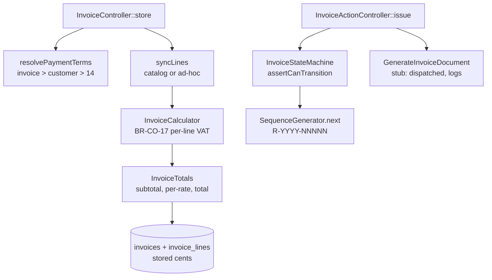

# 5. Building Block View

This section decomposes the system into its static building blocks. It is filled
incrementally as each milestone makes a part of the system real; the blocks
documented here are those that exist and are exercised by tests today. Sections
not yet built are marked as such.

## 5.1 Authentication & Tenancy

Authentication and multi-tenancy are the load-bearing infrastructure every other
building block depends on. Realizing [ADR 0002](../adr/0002-multi-tenancy.md)
(single-database multi-tenancy with a `tenant_id` discriminator), this block
establishes three guarantees that hold for every request to a protected route,
for the lifetime of the project: the request is **authenticated**, its **tenant
is resolved and bound**, and the caller's **role is checked**. Every business
feature built afterward — customers, products, invoices, e-invoicing — inherits
these guarantees automatically rather than re-implementing them.

The decisive design choice is that tenant isolation is a **structural property
of the query layer, not a discipline developers must remember**. A model opts
into tenant ownership by using the `BelongsToTenant` trait; from that point every
query against it is filtered to the active tenant by a global scope, with no
`where` clause in application code. Isolation that depends on each developer
remembering a `where tenant_id = ?` is isolation that eventually leaks; isolation
enforced once, at the scope, does not.

### The request pipeline

A request to a protected endpoint passes through the middleware pipeline before
reaching a controller. Each stage is a distinct building block with a single
responsibility:

The single most important seam in the whole milestone is the **`currentTenantId`
container binding**. It is the interface between `ResolveTenant` and every
`BelongsToTenant` model:

- `ResolveTenant` is the **only producer** of that binding on request paths. It
  runs after authentication, reads the authenticated user's tenant, and binds
  both the tenant model (`currentTenant`) and its id (`currentTenantId`) into the
  container for the duration of the request.
- `TenantScope` is the **only consumer**. On every query of a tenant-owned model
  it reads `currentTenantId` and adds a table-qualified `where tenant_id = ?`. If
  no tenant is bound — console commands, seeders, the registration flow that
  creates the very first tenant — the scope is a deliberate no-op, so trusted
  server-side code runs unscoped by design.

Because there is exactly one producer and one consumer of that binding, tenant
isolation on request paths is enforced in a single place that can be read,
audited, and tested in isolation. That is what makes isolation a structural
property rather than a per-query convention.

### Building blocks

| Block | Type | Responsibility |
|---|---|---|
| `Tenant`, `User` | Eloquent models | The tenant is the isolation boundary; the user belongs to exactly one tenant. Both expose a public UUID externally; the auto-increment id stays internal. |
| `Role` | Backed enum | Typed roles (owner/admin/member) with an ordinal rank, so an invalid role cannot exist in the model layer and gates compare by rank. |
| `BelongsToTenant` | Trait | Opt-in tenant ownership: registers the global scope, auto-stamps `tenant_id` on create from the request context, and makes `tenant_id` immutable after creation. |
| `TenantScope` | Global query scope | Filters every query of a tenant-owned model to the bound tenant. The consumer side of the `currentTenantId` seam. |
| `ResolveTenant` | Middleware | Binds `currentTenant` / `currentTenantId` after authentication. The producer side of the seam. |
| `EnsureRole` | Middleware | Route-level role gate, by ordinal rank (an owner satisfies `role:admin`). |
| `AuthController` | Controller | `register` (provisions a tenant and its owner in one transaction), `login`, `logout`, `me`. |
| `UserResource`, `TenantResource` | API resources | The output boundary: expose UUIDs only — never the password, remember-token, or internal id. |

### Interfaces

| Interface | Producer | Consumer | Contract |
|---|---|---|---|
| `currentTenantId` (container binding) | `ResolveTenant` | `TenantScope` | The active tenant's internal id, bound per request after auth. Absent for trusted server-side code, where the scope is a no-op. |
| Session cookie (HttpOnly) | Sanctum stateful guard | `auth:sanctum` | First-party SPA authentication; the session lives in a cookie JavaScript cannot read, with CSRF protection. |
| `TenantMismatchException` | `BelongsToTenant` (update guard) | Caller | Thrown if code attempts to reassign a record's `tenant_id` after creation — moving data across tenants is never legitimate. |
| `withoutTenantScope()` | `BelongsToTenant` | Trusted callers | The single, greppable, auditable escape hatch for a legitimate cross-tenant query. |

### Why cookie sessions, not tokens

The SPA and API share a top-level domain, so Sanctum's stateful session guard is
the correct and more secure choice: the session lives in an HttpOnly cookie that
JavaScript cannot read, with built-in CSRF protection, immune to the
XSS token-theft that `localStorage` bearer tokens invite. Sanctum's token
abilities remain available for a future mobile client or third-party API; they
are simply not used now.

## 5.2 Customer resource

Customers are the first tenant-owned business resource, and the first feature
composed almost entirely from the authentication and tenancy primitives of
§5.1 rather than from new isolation machinery. This is the point of the design:
the customer building block adds a model, a controller, validation, and an
output boundary — and **no tenant-ownership logic of its own**. Isolation,
tenant stamping, and the cross-tenant 404 are all inherited.

The `Customer` model opts into tenant ownership with the `BelongsToTenant`
trait, so every query against it is already filtered to the active tenant by
`TenantScope`. It carries a per-tenant document number (§5.3), a typed
`CustomerType` (company/individual) and `Country` (the 27 EU member states),
soft-delete support so a deleted customer's history survives, and a
`payment_terms_days` field laid down now for invoicing to read later. VAT IDs
are validated by a per-country format rule with the German checksum verified
in full; live VIES verification is deferred.

### The create-customer flow

The flow below is the whole architecture in miniature. Read it for what the
controller **does not** do: it writes no `tenant_id`, performs no ownership
check, and computes no number by hand. The role gate is middleware, the number
comes from a row-locked sequence, and the `tenant_id` is stamped by the trait.

The read path makes the same point from the other direction. The controller's
`show`, `update`, and `destroy` actions take a route-model-bound
`Customer $customer`. Because the binding query runs **through the tenant
global scope** — and because `ResolveTenant` is forced ahead of route-model
binding in the middleware priority list so the tenant is bound before the
lookup runs — a customer belonging to another tenant is simply *not found*.
Laravel returns **404, not 403**, with no `if ($customer->tenant_id !== …)`
check anywhere in the controller. 404 rather than 403 is deliberate: a 403
would confirm the record exists, leaking its existence across the tenant
boundary; a 404 reveals nothing. This is the cross-tenant contract the tenancy
milestone defined and deferred, now enforced structurally rather than by
convention.

### Building blocks

| Block | Type | Responsibility |
|---|---|---|
| `Customer` | Eloquent model (`BelongsToTenant`, `SoftDeletes`) | The first tenant-owned business model. UUID-keyed externally; per-tenant-unique document number; case-insensitive search scope. |
| `CustomerType` | Backed enum | company / individual, with a `requiresCompanyName()` predicate the validation reads. |
| `Country` | Backed enum | The 27 EU member states as ISO 3166-1 alpha-2 codes; the basis for VAT-format selection. |
| `VatId` | Validation rule | Per-country VAT-ID format, plus the full German USt-IdNr checksum. VIES online verification deferred to a later version. |
| `StoreCustomerRequest`, `UpdateCustomerRequest` | Form requests | Validated create/update. The update request deliberately omits `number`, making it immutable. |
| `CustomerController` | Resource controller | CRUD + soft-delete/restore + paginated search. Contains zero ownership or tenant-assignment code. |
| `CustomerResource` | API resource | The output boundary: exposes the UUID as `id`, never the internal id or `tenant_id`. |

### Interfaces

| Interface | Producer | Consumer | Contract |
|---|---|---|---|
| `GET/POST/PATCH/DELETE /api/v1/customers` | `CustomerController` | SPA, API clients | Reads behind `auth:sanctum` + `tenant`; writes additionally behind `role:admin`. |
| Route-model binding `{customer}` | `SubstituteBindings` (after `ResolveTenant`) | `CustomerController` | Resolves the UUID through the tenant scope, so cross-tenant lookups 404 automatically. |
| Customer number | `SequenceGenerator` (§5.3) | `CustomerController::store` | An atomic `K-YYYY-NNNNN` issued once at creation; immutable thereafter. |

## 5.3 Numbering service

Every German business document needs a gapless, per-tenant, annually-resetting
number: customers `K-YYYY-NNNNN`, invoices `R-…`, expenses `E-…`. This block
provides that once, generically, so customers consume it now and invoices and
expenses consume it later without change.

The mechanism is a single counter row per `(tenant_id, document_type, year)` in
`number_sequences`, and a `SequenceGenerator` service that increments it inside
a database transaction under a `SELECT ... FOR UPDATE` row lock. The lock is the
correctness mechanism: two simultaneous creates for the same tenant, type, and
year serialize on that one row, so each receives a distinct, consecutive value
rather than colliding. A unique `(tenant_id, document_type, year)` index sits
beneath the application logic as an integrity backstop — even if the logic ever
faltered, the database itself refuses a duplicate counter row.

`NumberSequence` is the one tenant-owned-by-convention model that deliberately
**does not** use `BelongsToTenant`: the generator manages tenant scoping by hand
inside the lock, and the trait's global scope and auto-stamp would interfere with
the locked lookup that may need to create the first row. The numbering year is an
explicit argument, defaulting to the current year, so a back-dated document lands
in the correct annual sequence rather than the sequence of its insertion date.

### Building blocks

| Block | Type | Responsibility |
|---|---|---|
| `NumberSequence` | Eloquent model | One counter row per (tenant, document type, year). Accessed only through `SequenceGenerator`, never queried directly. |
| `SequenceGenerator` | Service | Issues `PREFIX-YYYY-NNNNN` atomically under a row lock. The single producer of document numbers. |
| `DocumentType` | Backed enum | customer/invoice/expense, each with its single-letter prefix (K/R/E). |

### Interfaces

| Interface | Producer | Consumer | Contract |
|---|---|---|---|
| `SequenceGenerator::next(Tenant, DocumentType, ?year)` | `SequenceGenerator` | Resource controllers (Customers now; invoices, expenses later) | Returns a distinct, gapless, formatted number under a row lock. Correct under concurrency on Postgres. |
| Unique `(tenant_id, document_type, year)` index | `number_sequences` migration | Database | Integrity backstop guaranteeing one counter row per tenant/type/year, independent of application logic. |

## 5.4 Product catalog & the money/units value layer

The catalog is the second tenant-owned business resource, and like customers it
adds no isolation machinery of its own — `Product` uses `BelongsToTenant`, so
tenant scoping, stamping, and the cross-tenant 404 are all inherited from §5.1.
What the catalog introduces instead are two primitives that invoicing depends on
and will reuse unchanged: a **money value layer** that keeps money as integer
cents everywhere, and a **unit enum that carries its UN/ECE code** for EN 16931
line output.

### The cents boundary

The decisive rule for money is FR-026 / TC-12: money is **integer cents, never a
float**. This milestone makes that rule executable rather than aspirational. The
amount is integer cents at every hop — the client form, the wire, the column, and
back — and the only thing that ever performs money arithmetic or formatting is
`brick/money`, which uses arbitrary-precision `BigDecimal` internally. A PHP
float is not merely discouraged; it is **rejected** at the cast boundary rather
than silently rounded.

Two pieces enforce this rather than leave it to reviewer vigilance. The column is
a `BIGINT` (`unsignedBigInteger`) — a test queries `information_schema` to assert
the stored type is an integer family, so even a regression in application code
cannot make the schema floating point. And `MoneyCast::set` accepts a `Money` or
integer-like cents and **throws** on anything else, so the one mistake FR-026
exists to prevent — constructing money from a float — fails loudly at the seam.
On the client the same discipline holds in miniature: `eurosToCents` converts the
EUR field to integer cents before the request, and the only division by 100 is in
`centsToEuros`, a one-way render for the eye that is never fed back into storage.

A deliberate modeling choice worth recording: the column is named
`unit_price_cents` so the "this is cents" fact is never lost, and `Product`
exposes it through a `price` accessor returning a `brick/money` `Money`. The
reusable `MoneyCast` stays available for models whose attribute is literally the
money name; this model uses the accessor instead. One money approach per model —
never both, since registering `price` in `casts()` and as an accessor would
collide.

### Unit codes live on the enum

EN 16931 requires a UN/ECE Recommendation 20 unit code on every invoice line. The
`Unit` enum carries that code on each case (`Stück → H87`, `Stunde → HUR`,
`Kilogramm → KGM`, `Meter → MTR`, `Quadratmeter → MTK`, `Tag → DAY`,
`pauschal → LS`), so invoicing reads `$unit->uneceCode()` directly with **no
separate lookup table to drift out of sync**. The backed value is the German
display label; the UN/ECE code is the machine code emitted into ZUGFeRD/XRechnung.
Placing the mapping on the enum now, ahead of invoicing needing it, is the same
move as putting numbering on a generic service: the dependency inherits a correct
implementation instead of reinventing one.

### Archive, not delete

Products are **archived**, never deleted (FR-027). Archiving is an `is_active`
flag, not a soft delete: an archived product stays fully readable because an
invoice line may reference it indefinitely, but the `active()` scope drops it from
the product picker for new invoices. There is deliberately **no destroy
endpoint** — a `DELETE` returns 405, proven by test — because a product that an
invoice depends on must always resolve.

### Building blocks

| Block | Type | Responsibility |
|---|---|---|
| `Product` | Eloquent model (`BelongsToTenant`) | The catalog model. UUID-keyed externally; integer-cents pricing via a `price` accessor; `active()` and case-insensitive `search()` scopes. No tenant-ownership code of its own. |
| `VatRate` | Backed enum (int) | The three German rates 19/7/0 (FR-024); multipliers returned as decimal **strings** for `brick/money` arithmetic, never floats. |
| `Unit` | Backed enum (string) | The seven supported units (FR-025), each carrying its UN/ECE Rec 20 code via `uneceCode()`. |
| `Money` (support) | Value helper | The single place integer cents become a German EUR string and back, over `brick/money`. |
| `MoneyCast` | Eloquent cast | Bridges an integer-cents column and a `brick/money` `Money`; throws on a float (FR-026). Reusable; not used by `Product`, which uses the accessor. |
| `StoreProductRequest`, `UpdateProductRequest` | Form requests | Validated create/update; price arrives as integer cents. The update request omits `is_active` — archiving is an explicit action, not a silent field write. |
| `ProductController` | Resource controller | CRUD + archive/unarchive + paginated search. No `destroy`. Contains zero ownership or tenant-assignment code. |
| `ProductResource` | API resource | Exposes `unit_price_cents`, a formatted `unit_price_formatted`, and `unit_code` — so the client computes on cents, displays the string, and has the EN 16931 code ready. |

### Interfaces

| Interface | Producer | Consumer | Contract |
|---|---|---|---|
| `GET/POST/PATCH /api/v1/products`, `…/{product}/archive`, `…/unarchive` | `ProductController` | SPA, API clients | Reads behind `auth:sanctum` + `tenant`; writes additionally behind `role:admin`. No `DELETE` (products archive). |
| `unit_price_cents` (integer cents) | client `eurosToCents` / API | `unit_price_cents` `BIGINT` column | Money crosses every boundary as integer cents; a float is rejected at `MoneyCast`. |
| `Unit::uneceCode()` | `Unit` enum | Invoicing (later), `ProductResource` | The EN 16931 line-unit code, on the enum, so there is no separate mapping table. |
| Route-model binding `{product}` | `SubstituteBindings` (after `ResolveTenant`) | `ProductController` | Resolves the UUID through the tenant scope, so cross-tenant lookups 404 automatically. |

## 5.5 Invoicing core

Invoicing is the milestone the whole project was pointed at: it composes the
customers to bill, the products to bill for, the money to bill in, and the
numbers to bill under into one aggregate. Like the customer and catalog blocks
it inherits tenant isolation from §5.1 rather than re-implementing it — `Invoice`
and `Payment` use `BelongsToTenant`; `InvoiceLine` is not independently scoped
because it is only ever reached through its parent invoice. What this block adds
that is genuinely new is **two pieces of pure domain logic kept out of the
controllers**: a line-level VAT calculator and an explicit state machine.

### Line-level VAT rounding is the load-bearing rule

The single most important correctness rule in the system is EN 16931 **BR-CO-17**:
VAT is computed **per line, rounded per line, then summed** — never computed once
on the document subtotal. The two approaches differ by one or two cents on
multi-rate invoices, and that difference fails KoSIT validation. `InvoiceCalculator`
implements the rule; it takes plain `InvoiceLineInput` value objects and returns
an immutable `InvoiceTotals` carrying the subtotal, the total VAT, the grand
total, and a **per-rate breakdown** (`rate → {net, vat}`) that ZUGFeRD's tax
subtotal groups require. The calculator is DB-free and pure, so it is testable in
isolation and reusable by the model layer now and the ZUGFeRD generator later.

All arithmetic is `brick/math` `BigDecimal` with explicit `HALF_UP` rounding to
whole cents; no PHP float ever touches a monetary value. Quantities are decimal
strings (2.5 hours is valid) and stay in arbitrary precision until the explicit
per-line rounding. The decisive evidence that the rule is actually implemented is
a test that constructs a case where line-level rounding (30 cents) and
document-level rounding (29) genuinely diverge — if anyone "simplifies" the
calculator to tax the subtotal, that test goes red.

### The lifecycle is one transition table, not scattered conditionals

An invoice has a legally-meaningful lifecycle, enforced by `InvoiceStateMachine`
(see [ADR 0005](../adr/0005-invoice-state-machine.md) and the §6 runtime view):
`draft → issued → sent → (partially_paid | paid)`, with any non-paid state able
to be cancelled, and `paid`/`cancelled` terminal. The legal transitions live in
**one table**; `assertCanTransition` is the single gate every transition passes
through, throwing `InvalidTransitionException` — which renders as **HTTP 409**
carrying the current and attempted states — on an illegal move. The controller
never re-encodes legality. Issuing is the pivotal transition: it mints the
`R-YYYY-NNNNN` number via the §5.3 `SequenceGenerator`, sets `issued_at`, freezes
the line items (only a draft is editable — a write to an issued invoice 409s), and
**dispatches** `GenerateInvoiceDocument`.

That job is, in this milestone, a **stub**: it implements `ShouldQueue` and logs.
The real ZUGFeRD/PDF generation (FR-041–FR-048) is a separate milestone; here the
issue flow's contract — mint, lock, dispatch — is complete and tested (via
`Queue::fake`/`assertPushed`) without building the generator prematurely. The
stub's `handle()` is the seam the e-invoicing milestone plugs into.

### Totals are server-authoritative

The server is the single source of truth for money. `Invoice::recalculateTotals()`
runs the calculator on every draft create and update and persists both the
document totals and each line's computed net and VAT; the API ignores any
client-sent totals entirely. The SPA editor shows a live preview using the same
line-level algorithm so what the user sees matches what the server stores, but the
preview never writes totals — it is convenience, not authority.

Payment-terms precedence (FR-036, FR-040) is resolved by a pure static helper,
`Invoice::resolvePaymentTerms()`: an explicit invoice-level value wins, else the
customer's default, else the tenant default of 14 days — used at draft creation to
derive the due date.

### Building blocks

| Block | Type | Responsibility |
|---|---|---|
| `InvoiceCalculator` | Service (pure) | Line-level VAT rounding per BR-CO-17 in `BigDecimal`; returns `InvoiceTotals`. DB-free and reusable. |
| `InvoiceTotals`, `InvoiceLineInput` | Value objects (readonly) | The calculator's output (subtotal, total VAT, grand total, per-rate breakdown) and its decoupled input unit. |
| `InvoiceStateMachine` | Service (pure) | The lifecycle as one transition table; `assertCanTransition` is the single gate. |
| `InvalidTransitionException` | Exception | Self-renders as HTTP 409 with current + attempted state. |
| `InvoiceState`, `PaymentMethod` | Backed enums | Lifecycle states (with `allowsLineEditing()` / `isTerminal()`) and payment methods. |
| `Invoice` | Eloquent model (`BelongsToTenant`) | Aggregate root owning lines and payments; `recalculateTotals()`, `paidCents()`, `resolvePaymentTerms()`. Number null while draft, unique per tenant once minted. |
| `InvoiceLine` | Eloquent model | Decimal quantity (never float), cents price, persisted per-line net/vat; optional product reference. Isolation inherited via the aggregate, not its own scope. |
| `Payment` | Eloquent model (`BelongsToTenant`) | A recorded payment; the sum drives the partially_paid/paid transition. |
| `GenerateInvoiceDocument` | Queued job (**stub**) | Dispatched on issue; logs only. The seam for ZUGFeRD/PDF (FR-041+). |
| `InvoiceController` | Controller | Create/update drafts (server-recomputed totals), list, show. |
| `InvoiceActionController` | Controller | issue / send / record-payment / cancel — every transition through the state machine. |
| `InvoiceResource`, `InvoiceLineResource`, `PaymentResource` | API resources | Controlled JSON; cents plus formatted strings; per-rate-ready line data. |

### Interfaces

| Interface | Producer | Consumer | Contract |
|---|---|---|---|
| `GET/POST/PATCH /api/v1/invoices`, `…/{invoice}/{issue,send,payments,cancel}` | `InvoiceController`, `InvoiceActionController` | SPA, API clients | Reads behind `auth:sanctum` + `tenant`; writes additionally behind `role:admin`. |
| `InvoiceCalculator::calculate(list<InvoiceLineInput>)` | `InvoiceCalculator` | `Invoice::recalculateTotals`, SPA preview (mirrored), ZUGFeRD (later) | Line-level VAT, `HALF_UP`, float-free; returns `InvoiceTotals` with the per-rate breakdown. |
| `InvoiceStateMachine::assertCanTransition(from, to)` | `InvoiceStateMachine` | Action controller | Throws `InvalidTransitionException` (409) on an illegal transition; the single legality gate. |
| `GenerateInvoiceDocument` dispatch | `InvoiceActionController::issue` | Queue (ZUGFeRD milestone) | Issuing dispatches the job; the handler is a stub until e-invoicing lands. |
| `SequenceGenerator::next(Tenant, DocumentType::Invoice)` | §5.3 | `InvoiceActionController::issue` | Mints the `R-YYYY-NNNNN` number atomically when an invoice is issued. |

## 5.6 and beyond

The remaining building blocks (e-invoicing, expense tracking, dashboard, tenant
settings) are documented as each is built in its milestone.
