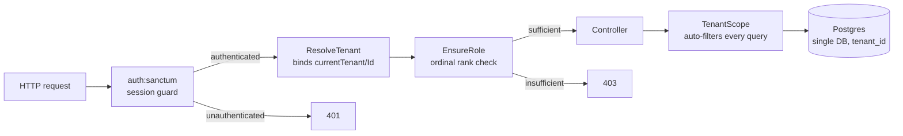
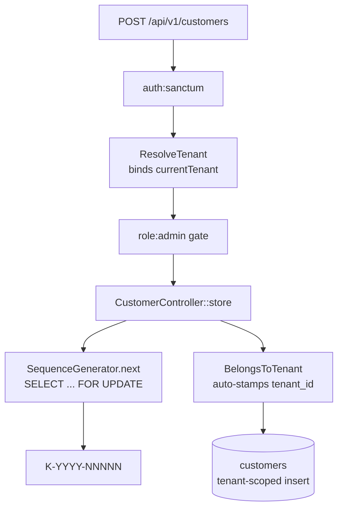

# 5. Building Block View

This section decomposes the system into its static building blocks. It is filled
incrementally as each milestone makes a part of the system real; the blocks
documented here are those that exist and are exercised by tests today. Sections
not yet built are marked as such.

## 5.1 Authentication & Tenancy

Authentication and multi-tenancy are the load-bearing infrastructure every other
building block depends on. Realizing [ADR 0002](../adr/0002-multi-tenancy.md)
(single-database multi-tenancy with a `tenant_id` discriminator), this block
establishes three guarantees that hold for every request to a protected route,
for the lifetime of the project: the request is **authenticated**, its **tenant
is resolved and bound**, and the caller's **role is checked**. Every business
feature built afterward — customers, products, invoices, e-invoicing — inherits
these guarantees automatically rather than re-implementing them.

The decisive design choice is that tenant isolation is a **structural property
of the query layer, not a discipline developers must remember**. A model opts
into tenant ownership by using the `BelongsToTenant` trait; from that point every
query against it is filtered to the active tenant by a global scope, with no
`where` clause in application code. Isolation that depends on each developer
remembering a `where tenant_id = ?` is isolation that eventually leaks; isolation
enforced once, at the scope, does not.

### The request pipeline

A request to a protected endpoint passes through the middleware pipeline before
reaching a controller. Each stage is a distinct building block with a single
responsibility:

The single most important seam in the whole milestone is the **`currentTenantId`
container binding**. It is the interface between `ResolveTenant` and every
`BelongsToTenant` model:

- `ResolveTenant` is the **only producer** of that binding on request paths. It
  runs after authentication, reads the authenticated user's tenant, and binds
  both the tenant model (`currentTenant`) and its id (`currentTenantId`) into the
  container for the duration of the request.
- `TenantScope` is the **only consumer**. On every query of a tenant-owned model
  it reads `currentTenantId` and adds a table-qualified `where tenant_id = ?`. If
  no tenant is bound — console commands, seeders, the registration flow that
  creates the very first tenant — the scope is a deliberate no-op, so trusted
  server-side code runs unscoped by design.

Because there is exactly one producer and one consumer of that binding, tenant
isolation on request paths is enforced in a single place that can be read,
audited, and tested in isolation. That is what makes isolation a structural
property rather than a per-query convention.

### Building blocks

| Block | Type | Responsibility |
|---|---|---|
| `Tenant`, `User` | Eloquent models | The tenant is the isolation boundary; the user belongs to exactly one tenant. Both expose a public UUID externally; the auto-increment id stays internal. |
| `Role` | Backed enum | Typed roles (owner/admin/member) with an ordinal rank, so an invalid role cannot exist in the model layer and gates compare by rank. |
| `BelongsToTenant` | Trait | Opt-in tenant ownership: registers the global scope, auto-stamps `tenant_id` on create from the request context, and makes `tenant_id` immutable after creation. |
| `TenantScope` | Global query scope | Filters every query of a tenant-owned model to the bound tenant. The consumer side of the `currentTenantId` seam. |
| `ResolveTenant` | Middleware | Binds `currentTenant` / `currentTenantId` after authentication. The producer side of the seam. |
| `EnsureRole` | Middleware | Route-level role gate, by ordinal rank (an owner satisfies `role:admin`). |
| `AuthController` | Controller | `register` (provisions a tenant and its owner in one transaction), `login`, `logout`, `me`. |
| `UserResource`, `TenantResource` | API resources | The output boundary: expose UUIDs only — never the password, remember-token, or internal id. |

### Interfaces

| Interface | Producer | Consumer | Contract |
|---|---|---|---|
| `currentTenantId` (container binding) | `ResolveTenant` | `TenantScope` | The active tenant's internal id, bound per request after auth. Absent for trusted server-side code, where the scope is a no-op. |
| Session cookie (HttpOnly) | Sanctum stateful guard | `auth:sanctum` | First-party SPA authentication; the session lives in a cookie JavaScript cannot read, with CSRF protection. |
| `TenantMismatchException` | `BelongsToTenant` (update guard) | Caller | Thrown if code attempts to reassign a record's `tenant_id` after creation — moving data across tenants is never legitimate. |
| `withoutTenantScope()` | `BelongsToTenant` | Trusted callers | The single, greppable, auditable escape hatch for a legitimate cross-tenant query. |

### Why cookie sessions, not tokens

The SPA and API share a top-level domain, so Sanctum's stateful session guard is
the correct and more secure choice: the session lives in an HttpOnly cookie that
JavaScript cannot read, with built-in CSRF protection, immune to the
XSS token-theft that `localStorage` bearer tokens invite. Sanctum's token
abilities remain available for a future mobile client or third-party API; they
are simply not used now.

## 5.2 Customer resource

Customers are the first tenant-owned business resource, and the first feature
composed almost entirely from the authentication and tenancy primitives of
§5.1 rather than from new isolation machinery. This is the point of the design:
the customer building block adds a model, a controller, validation, and an
output boundary — and **no tenant-ownership logic of its own**. Isolation,
tenant stamping, and the cross-tenant 404 are all inherited.

The `Customer` model opts into tenant ownership with the `BelongsToTenant`
trait, so every query against it is already filtered to the active tenant by
`TenantScope`. It carries a per-tenant document number (§5.3), a typed
`CustomerType` (company/individual) and `Country` (the 27 EU member states),
soft-delete support so a deleted customer's history survives, and a
`payment_terms_days` field laid down now for invoicing to read later. VAT IDs
are validated by a per-country format rule with the German checksum verified
in full; live VIES verification is deferred.

### The create-customer flow

The flow below is the whole architecture in miniature. Read it for what the
controller **does not** do: it writes no `tenant_id`, performs no ownership
check, and computes no number by hand. The role gate is middleware, the number
comes from a row-locked sequence, and the `tenant_id` is stamped by the trait.

The read path makes the same point from the other direction. The controller's
`show`, `update`, and `destroy` actions take a route-model-bound
`Customer $customer`. Because the binding query runs **through the tenant
global scope** — and because `ResolveTenant` is forced ahead of route-model
binding in the middleware priority list so the tenant is bound before the
lookup runs — a customer belonging to another tenant is simply *not found*.
Laravel returns **404, not 403**, with no `if ($customer->tenant_id !== …)`
check anywhere in the controller. 404 rather than 403 is deliberate: a 403
would confirm the record exists, leaking its existence across the tenant
boundary; a 404 reveals nothing. This is the cross-tenant contract the tenancy
milestone defined and deferred, now enforced structurally rather than by
convention.

### Building blocks

| Block | Type | Responsibility |
|---|---|---|
| `Customer` | Eloquent model (`BelongsToTenant`, `SoftDeletes`) | The first tenant-owned business model. UUID-keyed externally; per-tenant-unique document number; case-insensitive search scope. |
| `CustomerType` | Backed enum | company / individual, with a `requiresCompanyName()` predicate the validation reads. |
| `Country` | Backed enum | The 27 EU member states as ISO 3166-1 alpha-2 codes; the basis for VAT-format selection. |
| `VatId` | Validation rule | Per-country VAT-ID format, plus the full German USt-IdNr checksum. VIES online verification deferred to a later version. |
| `StoreCustomerRequest`, `UpdateCustomerRequest` | Form requests | Validated create/update. The update request deliberately omits `number`, making it immutable. |
| `CustomerController` | Resource controller | CRUD + soft-delete/restore + paginated search. Contains zero ownership or tenant-assignment code. |
| `CustomerResource` | API resource | The output boundary: exposes the UUID as `id`, never the internal id or `tenant_id`. |

### Interfaces

| Interface | Producer | Consumer | Contract |
|---|---|---|---|
| `GET/POST/PATCH/DELETE /api/v1/customers` | `CustomerController` | SPA, API clients | Reads behind `auth:sanctum` + `tenant`; writes additionally behind `role:admin`. |
| Route-model binding `{customer}` | `SubstituteBindings` (after `ResolveTenant`) | `CustomerController` | Resolves the UUID through the tenant scope, so cross-tenant lookups 404 automatically. |
| Customer number | `SequenceGenerator` (§5.3) | `CustomerController::store` | An atomic `K-YYYY-NNNNN` issued once at creation; immutable thereafter. |

## 5.3 Numbering service

Every German business document needs a gapless, per-tenant, annually-resetting
number: customers `K-YYYY-NNNNN`, invoices `R-…`, expenses `E-…`. This block
provides that once, generically, so customers consume it now and invoices and
expenses consume it later without change.

The mechanism is a single counter row per `(tenant_id, document_type, year)` in
`number_sequences`, and a `SequenceGenerator` service that increments it inside
a database transaction under a `SELECT ... FOR UPDATE` row lock. The lock is the
correctness mechanism: two simultaneous creates for the same tenant, type, and
year serialize on that one row, so each receives a distinct, consecutive value
rather than colliding. A unique `(tenant_id, document_type, year)` index sits
beneath the application logic as an integrity backstop — even if the logic ever
faltered, the database itself refuses a duplicate counter row.

`NumberSequence` is the one tenant-owned-by-convention model that deliberately
**does not** use `BelongsToTenant`: the generator manages tenant scoping by hand
inside the lock, and the trait's global scope and auto-stamp would interfere with
the locked lookup that may need to create the first row. The numbering year is an
explicit argument, defaulting to the current year, so a back-dated document lands
in the correct annual sequence rather than the sequence of its insertion date.

### Building blocks

| Block | Type | Responsibility |
|---|---|---|
| `NumberSequence` | Eloquent model | One counter row per (tenant, document type, year). Accessed only through `SequenceGenerator`, never queried directly. |
| `SequenceGenerator` | Service | Issues `PREFIX-YYYY-NNNNN` atomically under a row lock. The single producer of document numbers. |
| `DocumentType` | Backed enum | customer/invoice/expense, each with its single-letter prefix (K/R/E). |

### Interfaces

| Interface | Producer | Consumer | Contract |
|---|---|---|---|
| `SequenceGenerator::next(Tenant, DocumentType, ?year)` | `SequenceGenerator` | Resource controllers (Customers now; invoices, expenses later) | Returns a distinct, gapless, formatted number under a row lock. Correct under concurrency on Postgres. |
| Unique `(tenant_id, document_type, year)` index | `number_sequences` migration | Database | Integrity backstop guaranteeing one counter row per tenant/type/year, independent of application logic. |

## 5.4 and beyond

The remaining building blocks (catalog, invoicing core, e-invoicing, expense
tracking, dashboard, tenant settings) are documented as each is built in its
milestone.
