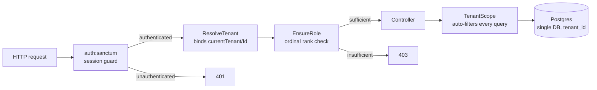

# 5. Building Block View

This section decomposes the system into its static building blocks. It is filled
incrementally as each milestone makes a part of the system real; the blocks
documented here are those that exist and are exercised by tests today. Sections
not yet built are marked as such.

## 5.1 Authentication & Tenancy

Authentication and multi-tenancy are the load-bearing infrastructure every other
building block depends on. Realizing [ADR 0002](../adr/0002-multi-tenancy.md)
(single-database multi-tenancy with a `tenant_id` discriminator), this block
establishes three guarantees that hold for every request to a protected route,
for the lifetime of the project: the request is **authenticated**, its **tenant
is resolved and bound**, and the caller's **role is checked**. Every business
feature built afterward — customers, products, invoices, e-invoicing — inherits
these guarantees automatically rather than re-implementing them.

The decisive design choice is that tenant isolation is a **structural property
of the query layer, not a discipline developers must remember**. A model opts
into tenant ownership by using the `BelongsToTenant` trait; from that point every
query against it is filtered to the active tenant by a global scope, with no
`where` clause in application code. Isolation that depends on each developer
remembering a `where tenant_id = ?` is isolation that eventually leaks; isolation
enforced once, at the scope, does not.

### The request pipeline

A request to a protected endpoint passes through the middleware pipeline before
reaching a controller. Each stage is a distinct building block with a single
responsibility:

The single most important seam in the whole milestone is the **`currentTenantId`
container binding**. It is the interface between `ResolveTenant` and every
`BelongsToTenant` model:

- `ResolveTenant` is the **only producer** of that binding on request paths. It
  runs after authentication, reads the authenticated user's tenant, and binds
  both the tenant model (`currentTenant`) and its id (`currentTenantId`) into the
  container for the duration of the request.
- `TenantScope` is the **only consumer**. On every query of a tenant-owned model
  it reads `currentTenantId` and adds a table-qualified `where tenant_id = ?`. If
  no tenant is bound — console commands, seeders, the registration flow that
  creates the very first tenant — the scope is a deliberate no-op, so trusted
  server-side code runs unscoped by design.

Because there is exactly one producer and one consumer of that binding, tenant
isolation on request paths is enforced in a single place that can be read,
audited, and tested in isolation. That is what makes isolation a structural
property rather than a per-query convention.

### Building blocks

| Block | Type | Responsibility |
|---|---|---|
| `Tenant`, `User` | Eloquent models | The tenant is the isolation boundary; the user belongs to exactly one tenant. Both expose a public UUID externally; the auto-increment id stays internal. |
| `Role` | Backed enum | Typed roles (owner/admin/member) with an ordinal rank, so an invalid role cannot exist in the model layer and gates compare by rank. |
| `BelongsToTenant` | Trait | Opt-in tenant ownership: registers the global scope, auto-stamps `tenant_id` on create from the request context, and makes `tenant_id` immutable after creation. |
| `TenantScope` | Global query scope | Filters every query of a tenant-owned model to the bound tenant. The consumer side of the `currentTenantId` seam. |
| `ResolveTenant` | Middleware | Binds `currentTenant` / `currentTenantId` after authentication. The producer side of the seam. |
| `EnsureRole` | Middleware | Route-level role gate, by ordinal rank (an owner satisfies `role:admin`). |
| `AuthController` | Controller | `register` (provisions a tenant and its owner in one transaction), `login`, `logout`, `me`. |
| `UserResource`, `TenantResource` | API resources | The output boundary: expose UUIDs only — never the password, remember-token, or internal id. |

### Interfaces

| Interface | Producer | Consumer | Contract |
|---|---|---|---|
| `currentTenantId` (container binding) | `ResolveTenant` | `TenantScope` | The active tenant's internal id, bound per request after auth. Absent for trusted server-side code, where the scope is a no-op. |
| Session cookie (HttpOnly) | Sanctum stateful guard | `auth:sanctum` | First-party SPA authentication; the session lives in a cookie JavaScript cannot read, with CSRF protection. |
| `TenantMismatchException` | `BelongsToTenant` (update guard) | Caller | Thrown if code attempts to reassign a record's `tenant_id` after creation — moving data across tenants is never legitimate. |
| `withoutTenantScope()` | `BelongsToTenant` | Trusted callers | The single, greppable, auditable escape hatch for a legitimate cross-tenant query. |

### Why cookie sessions, not tokens

The SPA and API share a top-level domain, so Sanctum's stateful session guard is
the correct and more secure choice: the session lives in an HttpOnly cookie that
JavaScript cannot read, with built-in CSRF protection, immune to the
XSS token-theft that `localStorage` bearer tokens invite. Sanctum's token
abilities remain available for a future mobile client or third-party API; they
are simply not used now.

## 5.2 and beyond

The remaining building blocks (customer management, catalog, invoicing core,
e-invoicing, expense tracking, dashboard, tenant settings) are documented as each
is built in its milestone.
