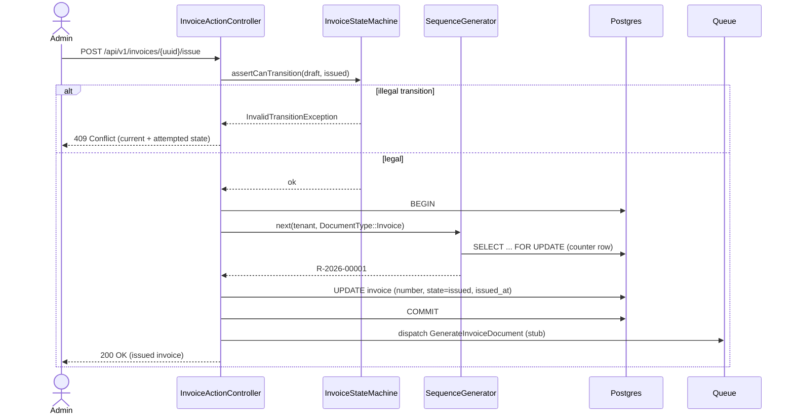
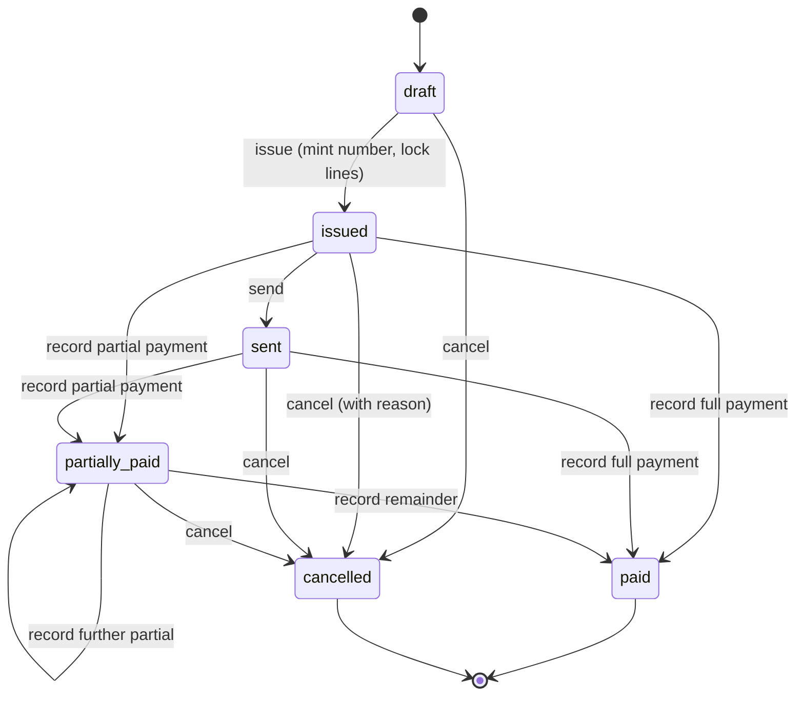

# 6. Runtime View

This section captures how the building blocks of §5 collaborate at runtime for
the scenarios that matter most. Like §5 it is filled incrementally; the scenarios
here are those exercised by tests today.

## 6.1 Issuing an invoice

Issuing is the pivotal transition in the invoice lifecycle (FR-033). It is the
moment a mutable draft becomes a legal document: it acquires a number, its lines
freeze, and document generation is kicked off. The sequence below shows the four
collaborators — the state machine that authorizes the move, the sequence
generator that mints the number under a row lock, the model that records the
transition, and the queued (stubbed) job that will later produce the ZUGFeRD
file.

Two properties are worth drawing out. First, the number is minted **inside** the
transaction, under the `SELECT ... FOR UPDATE` row lock of §5.3, so two
concurrent issues for the same tenant serialize and receive distinct consecutive
numbers — never a collision on the `(tenant_id, number)` unique index. Second,
the document job is **dispatched, not executed inline**, and in this milestone its
handler is a stub that only logs; the real ZUGFeRD/PDF generation
(FR-041–FR-048) plugs into that seam in a later milestone. After issue the
invoice is immutable: `InvoiceState::Issued->allowsLineEditing()` is `false`, so a
subsequent edit attempt is rejected with 409.

## 6.2 The invoice lifecycle

Every state transition in the system passes through `InvoiceStateMachine`, whose
legal moves are a single table. The diagram is that table made visible. Recording
a payment drives the state from the cumulative paid amount versus the total:
below the total it becomes `partially_paid` (and a further partial payment is a
legal transition to the same state); at or above the total it becomes `paid`.

`paid` and `cancelled` are terminal. A `paid` invoice **cannot** be cancelled
(FR-034): the transition `paid → cancelled` is absent from the table, so the
attempt raises `InvalidTransitionException` and renders as 409 rather than
silently reversing a settled invoice. Cancellation requires a reason, recorded
with `cancelled_at` for audit. Because legality lives only in the transition
table, the controller, the SPA's action buttons, and any future caller all defer
to the same single source of truth — the UI may hide an illegal action for
convenience, but the server remains authoritative.

## 6.3 and beyond

Further runtime scenarios (ZUGFeRD generation, expense capture, dashboard
aggregation) are documented as each is built in its milestone.
